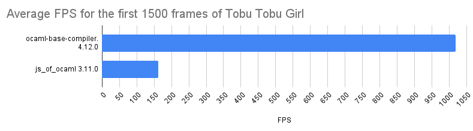
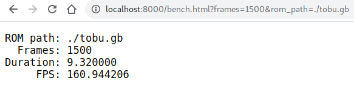

[](https://github.com/linoscope/CAMLBOY/actions/workflows/workflow.yml)
[](https://opensource.org/licenses/MIT)

<p align="center">
  
</p>

## About

**_CAMLBOY_** is a Game Boy emulator that runs in the browser. It is written in [OCaml](https://ocaml.org/) and compiled to JavaScript using [js_of_ocaml](http://ocsigen.org/js_of_ocaml/latest/manual/overview) (edit: After [#15](https://github.com/linoscope/CAMLBOY/pull/15) CAMLBOY is now compiled to WASM!).

Try it out in our **[demo page](https://linoscope.github.io/CAMLBOY/)**!

## Accompanied Posts and Videos

### Posts
- English: https://linoscope.github.io/writing-a-game-boy-emulator-in-ocaml/
- 日本語: https://qiita.com/linoscope/items/244d931aaae07df2c27e

### Videos

- Talk at Functional Conf 2025: https://www.youtube.com/watch?v=hFzHqxMar3g

## Screenshots

<div align="center">
  
</div>

<div align="center">
    
    
    
    
</div>

## Project goals and non-goals

### Goals

- Playable in the browser of middle-tier/high-tier mobile devices
- Readable/maintainable code that follows OCaml's best practices

### Stretch goals

- Achieve stable 60fps in low-tier mobile devices
- Serve as a benchmark target for various compile backends, similar to [optcarrot](https://github.com/mame/optcarrot) in the Ruby world. Would be especially interesting if we can compare the performance of various JS/wasm backends, such as [js_of_ocaml](http://ocsigen.org/js_of_ocaml/latest/manual/overview), [Rescript](https://rescript-lang.org/), [Melange](https://github.com/melange-re/melange), and [ocaml-wasm](https://github.com/corwin-of-amber/ocaml-wasm/tree/wasm-4.11).

### Non-goals

- Run all games with high accuracy
- Optimize performance to the limit at the expense of code readability

## Current state

- Runs with "playable" FPS in middle-tier mobile devices. (It runs at 60FPS for most games in my Galaxy S9, a smartphone released in 2018)
- Runs with ~1000FPS, with UI, in native
- Supports headless benchmarking mode, both for native and web, that runs without UI
- Passes various test ROMs such as Blargg's `cpu_insrts.gb` and `instr_timing.gb` (tests using Blargg's test ROMs can be found [here](https://github.com/linoscope/CAMLBOY/blob/main/test/rom_tests/test_blargg_test_roms.ml), and tests using Mooneye's test ROMs can be found [here](https://github.com/linoscope/CAMLBOY/tree/main/test/rom_tests/mooneye)).

## Benchmark results

We ran the first 1500 frames of [Tobu Tobu Girl](https://tangramgames.dk/tobutobugirl/) in headless mode (i.e., without UI) for ten times each and calculated the average FPS. The error bars represent the standard deviation. See [`benchmark.md`](benchmark.md) for details about the environment/commands used for the benchmark.[^1]

[^1]: Note that we can not use this benchmark to compare the FPS with other Game Boy emulators. This is because the performance of an emulator depends significantly on how accurate it is and how much functionality it has.

<div align="center">
  <figure>
    
  </figure>
  <div>
    <figure>
      
    </figure>
    <div><i>First 1500 frames of Tobu Tobu Girl (in 60FPS)</i></div>
  </div>
  <div>
    <figure>
      
    </figure>
    <div><i>First 1500 frames of Tobu Tobu Girl (in 1000FPS)</i></div>
  </div>
</div>

## Architecture diagram

Here is a rough sketch of the various modules and their relationship. You can find details in the [accompanied blog post](https://linoscope.github.io/writing-a-game-boy-emulator-in-ocaml/).

<div align="center">
  
</div>

## Directory Structure

- `lib` - Main emulator code
- `bin` - UI code
  - `web` - Web
  - `sdl2` - SDL2
- `test`
  - `unit_test` - Unit tests
  - `rom_test` - Integration tests that use test roms
- `resource`
  - `games` - Game roms
  - `test_roms` - Test roms used in `rom_tests`

## TODO

- [ ] Cartridge based save
- [x] Audio Processing Unit (APU)
- [ ] Rescript backend
- [ ] MBC5
- [ ] Game Boy Color mode

## Quick Start

### Prerequisites

- [opam](https://opam.ocaml.org/doc/Install.html) 2.1+

### Build

```sh
git clone https://github.com/linoscope/CAMLBOY.git
cd CAMLBOY
opam switch create . --locked --with-test
eval $(opam env)
dune build
```

## How to run

### Run with SDL2 UI (native)

```sh
$ dune build
# Usage: main.exe [--mode {default|60fps|withtrace|no-throttle}] [--no-blep] [--save-audio <file.wav>] <rom_path>
$ dune exec bin/sdl2/main.exe -- resource/games/tobu.gb
```

Available modes:
- `default` - Audio-synced emulation (audio enabled)
- `60fps` - 60 FPS throttled without audio
- `withtrace` - 60 FPS with instruction tracing
- `no-throttle` - Unthrottled (runs as fast as possible)

Audio options:
- `--no-blep` - Disable band-limited synthesis (BLEP) for square wave channels. BLEP reduces aliasing artifacts for higher audio quality. Disable for raw hardware-accurate output.
- `--save-audio <file.wav>` - Save audio output to a WAV file.

### Run with Web UI (js_of_ocaml/wasm)

```sh
dune build @serve-web
# Open localhost:8000 in your browser
```

Audio can be enabled using the checkbox in the web UI.

## How to run benchmarks

### Native benchmark

```sh
# Usage: bench.exe [--frames <frames>] <rom_path>
dune exec bin/sdl2/bench.exe -- resource/games/tobu.gb --frames 1500
```

### Web benchmark

After starting the web server (see above), open:
`http://localhost:8000/bench.html?frames=1500&rom_path=./tobu.gb`



## How to run tests

```sh
# Run all tests:
dune runtest
# Run unit tests only:
dune runtest test/unit_test/
# Run integration tests (tests that use test ROMs):
dune runtest test/rom_test/
```

## Updating the lock file

After modifying dependencies in `dune-project`:

```sh
opam pin add camlboy.dev . --no-action
opam lock camlboy
```

Commit the updated `camlboy.opam.locked` file.

## Resources

- [Pandocs](https://gbdev.io/pandocs/)
- [Game Boy CPU Manual](http://marc.rawer.de/Gameboy/Docs/GBCPUman.pdf)
- [gbops](https://izik1.github.io/gbops/)
- [GBEDG](https://hacktixme.ga/GBEDG/)
- [Imran Nazar's blog](https://imrannazar.com/GameBoy-Emulation-in-JavaScript)
- [codeslinger.co.uk](http://www.codeslinger.co.uk/pages/projects/gameboy.html)

## Source of built-in game ROMs:

- [The Bouncing Ball](https://gamejolt.com/games/the-bouncing-ball-gb/86699)
- [Tobu Tobu Girl](https://tangramgames.dk/tobutobugirl/)
- [Retroid](https://the-green-screen.com/292-2/#welcome)
- [Into The Blue](https://the-green-screen.com/278-2/#welcome)
- [Wishing Sarah](https://asteristic.itch.io/wishing-sarah)
- [Rocket Man Demo](https://lightgamesgb.com/portfolio/rocket-man/)
- [SHEET IT UP](https://drludos.itch.io/sheep-it-up)
- [Cavern](https://thegreatgallus.itch.io/cavern-mvm-9)
