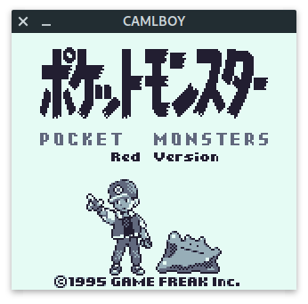
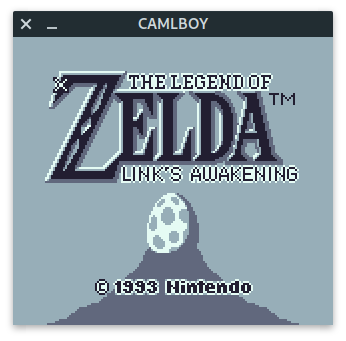
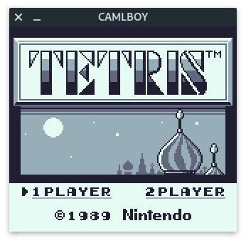

[](https://github.com/linoscope/CAMLBOY/actions/workflows/workflow.yml)
[](https://opensource.org/licenses/MIT)

# CAMLBOY

A Game Boy emulator written in OCaml 🐫🎮

**[Demo Page](https://linoscope.github.io/CAMLBOY/)**

## Features

- Can run both in the web browser and in the desktop natively
  - The web build uses [`js_of_ocaml`](https://ocsigen.org/js_of_ocaml/) (via the [`Brr`](https://github.com/dbuenzli/brr) library) + HTML canvas
  - The native desktop build uses [`SDL2`](https://www.libsdl.org/download-2.0.php) (via the [`Tsdl`](https://github.com/dbuenzli/tsdl) library)

## Screenshots

<div style="display:flex">
  
  
</div>






## How to build

### Common

- Install dependencies

```sh
opam install . --deps-only --with-test
```

### Web

- Build

```sh
dune build

```

- Serve `_build/default/bin/web` using some server. For example, run the following with python:

```sh
python -m http.server 8000 --directory _build/default/bin/web

```

- Open `localhost:8000` in the browser

### SDL2

- Run `dune exec bin/sdl2/main.exe -- <path_to_rom>`. For example:

```sh
dune exec bin/sdl2/main.exe -- resource/games/the-bouncing-ball.gb
```

## How to run tests

- To run all tests:

```sh
dune runtest
```

- To run unit tests only:

```sh
dune runtest test/unit_tests/
```

- To run integration tests that use test roms:

```sh
dune runtest test/rom_tests/
```

## Project Structure

- `lib` - Main emulator code
- `bin` - UI code
  - `web` - Web
  - `sdl2` - SDL2
- `test`
  - `unit_tests` - Unit tests
  - `rom_tests` - Integration tests that use test roms
- `resource`
  - `games` - Game roms
  - `test_roms` - Test roms used in `rom_tests`

## TODO

- [ ] MBC5
- [ ] Game Boy Color mode
- [ ] Audio Processing Unit (APU)
- [ ] Bench marks (compare default, flambda, js_of_ocaml, ...)

## Resources

- [Pandocs](https://gbdev.io/pandocs/)
- [Game Boy CPU Manual](http://marc.rawer.de/Gameboy/Docs/GBCPUman.pdf)
- [gbops](https://izik1.github.io/gbops/)
- [GBEDG](https://hacktixme.ga/GBEDG/)
- [Imran Nazar's blog](https://imrannazar.com/GameBoy-Emulation-in-JavaScript)
- [codeslinger.co.uk](http://www.codeslinger.co.uk/pages/projects/gameboy.html)

## Source of game ROMs:

- [The Bouncing Ball](https://gamejolt.com/games/the-bouncing-ball-gb/86699)
- [Tobu Tobu Girl](https://tangramgames.dk/tobutobugirl/)
- [Retroid](https://the-green-screen.com/292-2/#welcome)
- [Into The Blue](https://the-green-screen.com/278-2/#welcome)
- [Wishing Sarah](https://asteristic.itch.io/wishing-sarah)
- [Rocket Man Demo](https://lightgamesgb.com/portfolio/rocket-man/)
- [SHEET IT UP](https://drludos.itch.io/sheep-it-up)
