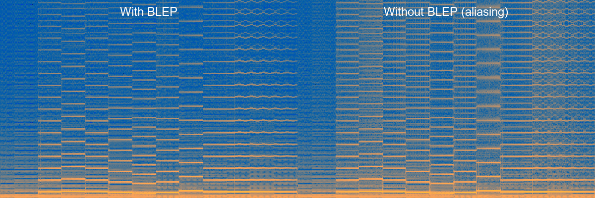

# CAMLBOY APU (Audio Processing Unit)

This module implements Game Boy audio emulation following the same architectural
patterns as the rest of CAMLBOY.

## Game Boy Sound Hardware Overview

The Game Boy APU generates audio through four independent sound channels that
feed into a stereo mixer:

| Channel   | Type            | Registers   | Features                          |
|-----------|-----------------|-------------|-----------------------------------|
| Square 1  | Pulse wave      | NR10-NR14   | Sweep, Duty, Envelope, Length     |
| Square 2  | Pulse wave      | NR21-NR24   | Duty, Envelope, Length            |
| Wave      | Custom waveform | NR30-NR34   | 32x4-bit samples, Volume, Length  |
| Noise     | LFSR            | NR41-NR44   | Envelope, Length                  |

### Memory Map

```
0xFF10 - NR10: Square 1 sweep
0xFF11 - NR11: Square 1 duty/length
0xFF12 - NR12: Square 1 volume envelope
0xFF13 - NR13: Square 1 frequency low
0xFF14 - NR14: Square 1 frequency high / control

0xFF15 - Unused
0xFF16 - NR21: Square 2 duty/length
0xFF17 - NR22: Square 2 volume envelope
0xFF18 - NR23: Square 2 frequency low
0xFF19 - NR24: Square 2 frequency high / control

0xFF1A - NR30: Wave DAC enable
0xFF1B - NR31: Wave length
0xFF1C - NR32: Wave volume
0xFF1D - NR33: Wave frequency low
0xFF1E - NR34: Wave frequency high / control

0xFF20 - NR41: Noise length
0xFF21 - NR42: Noise volume envelope
0xFF22 - NR43: Noise clock/width
0xFF23 - NR44: Noise control

0xFF24 - NR50: Master volume & Vin routing
0xFF25 - NR51: Sound panning (channel -> L/R)
0xFF26 - NR52: Sound on/off (master enable + channel status)

0xFF27-0xFF2F: Unused
0xFF30-0xFF3F: Wave RAM (16 bytes = 32 4-bit samples)
```

### Frame Sequencer

The frame sequencer is a 512 Hz clock that drives the modulation units. It runs
from the DIV timer and cycles through 8 steps:

| Step | Length Counter | Volume Envelope | Frequency Sweep |
|------|----------------|-----------------|-----------------|
| 0    | Clock          |                 |                 |
| 1    |                |                 |                 |
| 2    | Clock          |                 | Clock           |
| 3    |                |                 |                 |
| 4    | Clock          |                 |                 |
| 5    |                |                 |                 |
| 6    | Clock          |                 | Clock           |
| 7    |                | Clock           |                 |

- **Length Counter**: 256 Hz - Decrements and can disable the channel
- **Volume Envelope**: 64 Hz - Adjusts volume automatically up or down
- **Frequency Sweep**: 128 Hz - Modifies Square 1's frequency (up or down)

### Channel Signal Pipeline

Each channel has its own signal pipeline:

```
Square 1:  Sweep -> Timer -> Duty -> Length Counter -> Envelope -> DAC -> Mixer
Square 2:           Timer -> Duty -> Length Counter -> Envelope -> DAC -> Mixer
Wave:               Timer -> Wave -> Length Counter -> Volume   -> DAC -> Mixer
Noise:              Timer -> LFSR -> Length Counter -> Envelope -> DAC -> Mixer
```

- **Sweep**: Modifies Square 1's frequency over time (128 Hz clock)
- **Timer**: Generates clocks at the programmed frequency
  - Square: period = (2048 - frequency) × 4
  - Wave: period = (2048 - frequency) × 2
- **Duty/Wave/LFSR**: Produces the channel's waveform (8-step duty, 32 samples, or pseudo-random)
- **Length Counter**: Can disable the channel after a programmed duration (256 Hz clock)
- **Envelope/Volume**: Scales output amplitude (envelope auto-ramps at 64 Hz; wave has manual 4-level volume)
- **DAC**: Converts 4-bit digital (0-15) to analog (-1.0 to +1.0)
- **Mixer**: Combines channels per NR51 panning, applies NR50 master volume, then high-pass filters

## Implementation Architecture

### Module Structure

```
lib/apu/
├── apu.ml / apu.mli        Main APU orchestrator
├── frame_sequencer.ml      512 Hz clocking for modulation
├── length_counter.ml       Shared length counter logic
├── envelope.ml             Volume envelope (64 Hz)
├── sweep.ml                Frequency sweep for Square 1 (128 Hz)
├── square_channel.ml       Pulse wave generation
├── wave_channel.ml         Custom waveform playback
├── noise_channel.ml        LFSR pseudo-random noise
├── blep.ml                 Band-limited synthesis functor
├── mixer.ml                Channel mixing with panning and volume
└── audio_buffer.ml         Ring buffer for sample output
```

### Design Decisions

1. **Follows CAMLBOY patterns**:
   - Implements `Addressable_intf.S` for memory-mapped I/O
   - Uses `run ~mcycles` for cycle-accurate timing
   - Mutable records for hardware state
   - Integrates with interrupt controller (not currently used by APU)

2. **Audio callback drives emulation timing**:
   - Audio callback requests samples; emulation runs until they're ready
   - SDL2: callback runs in separate thread with mutex synchronization due to some
     with the binding's callback implementation.
   - Web: `ScriptProcessorNode.onaudioprocess` runs on main thread (no mutex needed)
   - Both use the same pattern: callback-driven, low-latency lock-step
   - Buffer is sized to ~1/3 capacity per callback to balance latency vs. underruns

3. **Band-limited synthesis (BLEP)**: See [Band-Limited Synthesis](#band-limited-synthesis-blep-1) below

4. **Strict separation between hardware and synthesis**:
   - Each channel module (`Square_channel`, etc.) implements pure hardware emulation
   - Channel modules expose accessors matching the `Blep.HARDWARE` signature
   - `Blep.Make(Square_channel)` creates a band-limited sampler from hardware state
   - `Mixer.Make` takes a sampler module, enabling `Mixer.Naive` vs `Mixer.Blep`

5. **Shared modules for common logic**:
   - Length counter is reused by all 4 channels
   - Envelope is shared by Square 1, Square 2, and Noise
   - Reduces code duplication while maintaining clarity

6. **Accuracy-ready design**:
   - Clean abstractions support future test ROM compliance
   - Frame sequencer timing matches hardware
   - Edge cases (trigger during length clock, etc.) can be added

### Timing Constants

- CPU clock: 4,194,304 Hz (T-cycles)
- M-cycle: 4 T-cycles -> 1,048,576 M-cycles/second
- Frame sequencer: 512 Hz -> 2048 M-cycles per step
- Sample rate: 44,100 Hz -> ~95 M-cycles per sample

### Square Wave Duty Cycles

```
12.5%: _______X  (1/8 high)
25%:   X______X  (2/8 high)
50%:   X___XXXX  (4/8 high) - actually XXXX___X
75%:   _XXXXXX_  (6/8 high)
```

The duty waveform tables are:
- 12.5%: `[0,0,0,0,0,0,0,1]`
- 25%:   `[1,0,0,0,0,0,0,1]`
- 50%:   `[1,0,0,0,0,1,1,1]`
- 75%:   `[0,1,1,1,1,1,1,0]`

### LFSR (Noise Channel)

The noise channel uses a Linear Feedback Shift Register:
- 15-bit LFSR by default
- Optional 7-bit mode for more "metallic" sounds
- XOR of bits 0 and 1 fed back to bit 14 (and bit 6 in 7-bit mode)

### Obscure Behaviors

The following hardware quirks are implemented for accuracy:

- **Wave channel first sample**: On trigger, the sample buffer is NOT updated.
  The first sample played is whatever was previously in the buffer; the new
  position 0 sample isn't read until the waveform advances.

- **Noise channel clock shift 14-15**: Using clock shift 14 or 15 results in
  the LFSR receiving no clocks, producing a static output.

- **Sweep negate-to-positive switch**: Clearing the sweep negate bit in NR10
  after at least one sweep calculation used negate mode (since the last trigger)
  immediately disables the channel.

- **Period 0 treated as 8**: Both envelope and sweep timers treat a period of 0
  as 8 for timer reload purposes. This prevents infinite-speed operation.

- **Trigger length reload quirk**: When triggering a channel with length enabled,
  if the counter was 0 (being reloaded to max) and the next frame sequencer step
  won't clock length, the counter is set to max-1 instead of max.

- **Extra length clocking on enable**: When writing to NRx4 and the next frame
  sequencer step won't clock length, if length was previously disabled and is
  now enabled and the counter is non-zero, the counter is decremented. If it
  reaches 0, the channel is disabled.

## Band-Limited Synthesis (BLEP)

### The Aliasing Problem

The Game Boy's square wave channels produce signals with instantaneous transitions
between high and low states. These sharp edges contain harmonics extending to
infinity. When we sample this signal at a finite rate (e.g., 44.1 kHz), any
harmonics above the Nyquist frequency (22.05 kHz) fold back into the audible
range as aliasing artifacts.

For example, a 2 kHz square wave has harmonics at 6 kHz, 10 kHz, 14 kHz, 18 kHz,
22 kHz, 26 kHz, etc. At 44.1 kHz sample rate, the 26 kHz harmonic aliases to
18.1 kHz (44.1 - 26), producing an audible tone that wasn't in the original signal.

This is particularly problematic for Game Boy emulation because:

1. **High fundamental frequencies**: Game Boy square waves can reach over 130 kHz
   (frequency register = 2047), well above human hearing but with harmonics that
   alias into audible range
2. **Rich harmonic content**: Square waves have strong odd harmonics (3rd, 5th, 7th...)
   that extend far beyond the fundamental
3. **Variable duty cycles**: Non-50% duty cycles add even harmonics, increasing
   the aliasing potential

### Visual Comparison



The image above shows the same audio rendered with and without BLEP. On the left,
BLEP produces clean, smooth waveforms. On the right, without BLEP, you can see
the characteristic "fuzzy" distortion caused by aliasing - the waveform appears
noisy and irregular due to folded-back high-frequency components.

### Why Original Hardware Didn't Have This Problem

The original Game Boy didn't have aliasing because it never sampled its own output.
The hardware path was a continuous analog signal:

```
Digital waveform generator → DAC → Analog amplifier → Speaker/Headphones
```

Aliasing only occurs when you **sample** a continuous signal at a finite rate. The
Game Boy's square waves went straight from the DAC to your ears as analog audio.

The sharp transitions were naturally softened by:

1. **DAC bandwidth**: The 4-bit DAC couldn't produce truly instantaneous transitions
2. **Capacitive coupling**: The audio output circuit had capacitors acting as low-pass filters
3. **Amplifier bandwidth**: The analog amp had limited slew rate
4. **Speaker physics**: A physical cone can't move infinitely fast

The "infinite" harmonics of a perfect square wave were already rolled off by the
analog electronics before reaching your ears. The Game Boy's characteristic sound
partly comes from these analog limitations.

When we emulate digitally, we're doing:

```
Emulated waveform → Sample at 44.1kHz → Sound card DAC → Speakers
```

That sampling step in the middle is where aliasing occurs. We're converting a
mathematically perfect square wave (with infinite harmonics) into discrete samples,
and the Nyquist theorem catches us. BLEP essentially simulates what the analog
circuitry did naturally - smoothing transitions to remove harmonics above what
our sample rate can represent.

### How polyBLEP Works

Band-Limited Step (BLEP) synthesis replaces the instant transitions of a naive
square wave with smooth, band-limited transitions that don't contain harmonics
above the Nyquist frequency.

The `blep.ml` module implements **polyBLEP** (polynomial BLEP), which:

1. **Detects transitions**: Identifies when the waveform crosses from high to low
   or vice versa
2. **Applies polynomial correction**: Near each transition, adds a polynomial
   correction term that smooths the edge over approximately one sample period
3. **Preserves waveform shape**: Away from transitions, the output matches the
   original square wave exactly

The polynomial used is:
- Just after a transition (t in [0, dt)): `2t - t² - 1`
- Just before a transition (t in [1-dt, 1)): `t² + 2t + 1`

Where `t` is the phase relative to the transition and `dt` is the normalized
frequency (frequency / sample_rate).

### Architecture

The implementation cleanly separates hardware emulation from synthesis:

```
┌─────────────────────┐     ┌─────────────────────┐
│  Square_channel.ml  │     │      blep.ml        │
│  (Hardware state)   │────>│  (BLEP synthesis)   │
│                     │     │                     │
│  - duty_position    │     │  - Computes phase   │
│  - frequency_timer  │     │  - Applies polyBLEP │
│  - timer_period     │     │  - Returns sample   │
│  - volume, etc.     │     │                     │
└─────────────────────┘     └─────────────────────┘
```

The `Blep.Make` functor takes any module implementing `Blep.HARDWARE` and produces
a band-limited sampler. This allows the same BLEP code to work with both square
channels while keeping hardware emulation pure and testable.

## References

- [Game Boy Sound Hardware (gbdev wiki)](https://gbdev.gg8.se/wiki/articles/Gameboy_sound_hardware)
- [Pan Docs - Audio](https://gbdev.io/pandocs/Audio.html)
- [SameBoy APU implementation](https://github.com/LIJI32/SameBoy/blob/master/Core/apu.c)
- [Blargg's APU test ROMs](https://github.com/retrio/gb-test-roms)
- [Making Audio Plugins Part 18: PolyBLEP Oscillator](https://www.martin-finke.de/articles/audio-plugins-018-polyblep-oscillator/)
